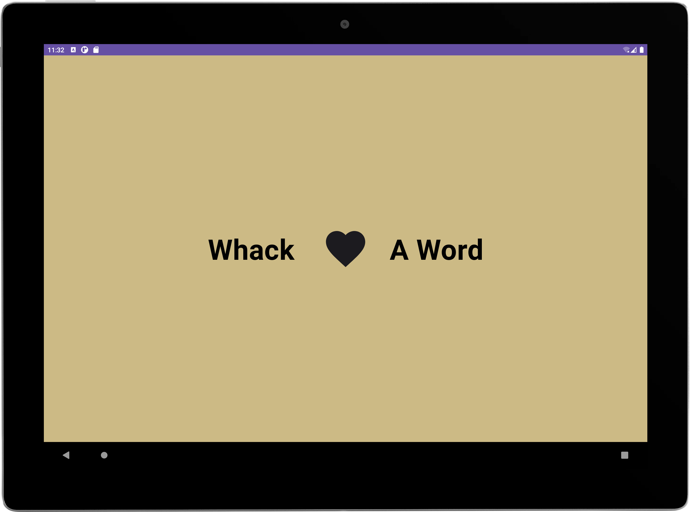
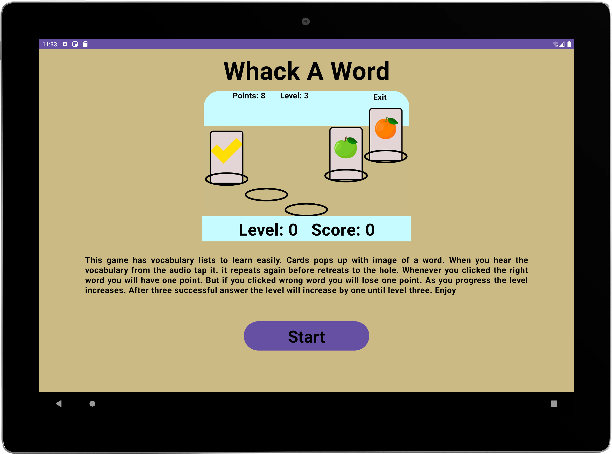
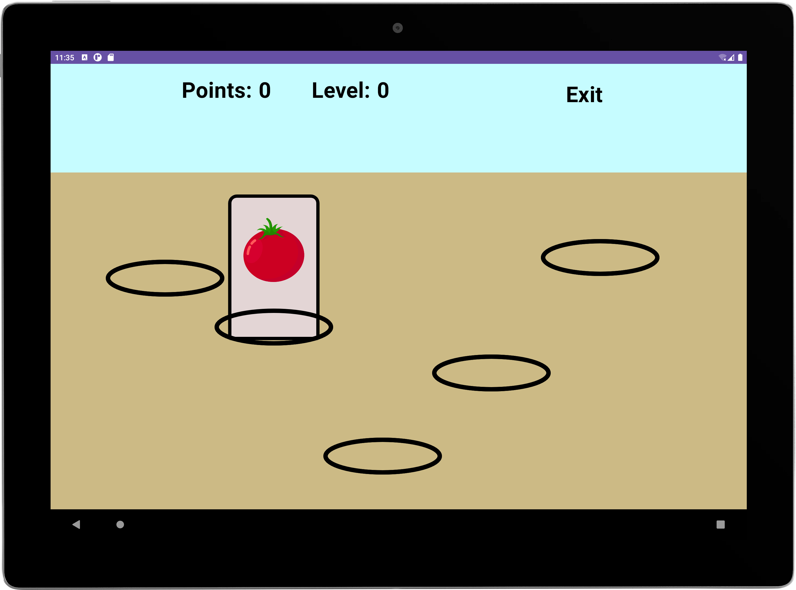
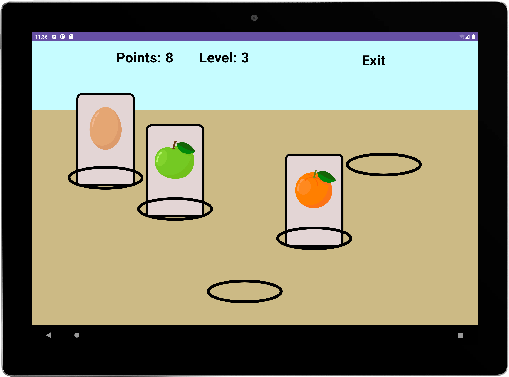
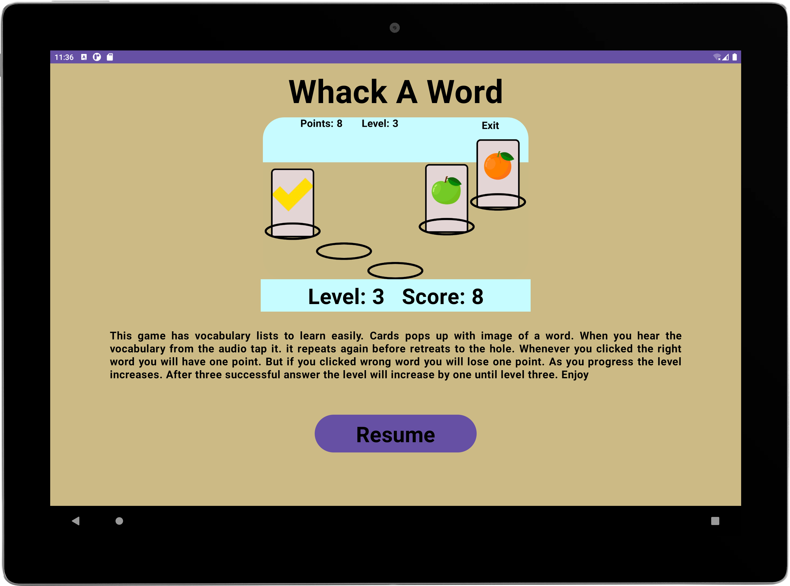
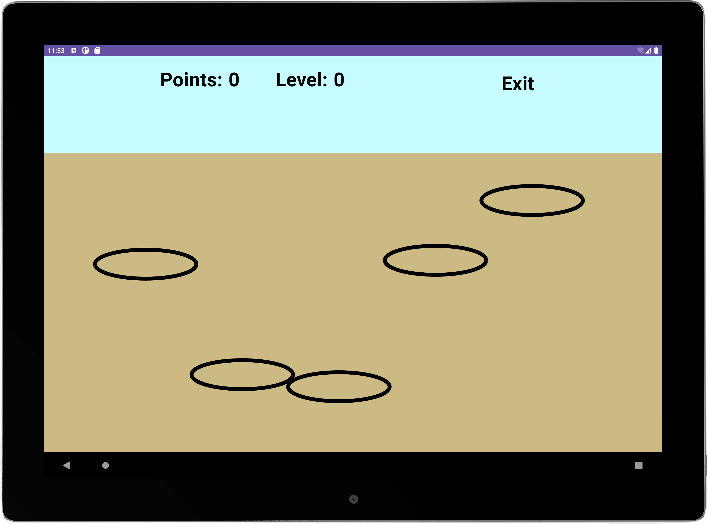
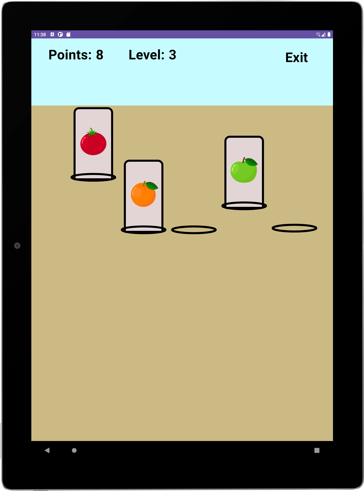

# Whack-A-Word-Game

A simple Whack A Word game for vocabulary learning to kids. 

- It will increase your score by one as you keep tapping the target word and decrease by the same amount if you miss. 
- It is developed for Android Tablet

## Android Tablet UI Screenshots

  
  
  
  
  
  
  
  

# Tech Stacks
This project uses many of the popular libraries, plugins, and tools of the Android ecosystem.

- [Compose](https://developer.android.com/jetpack/compose)
  
    - [Material](https://developer.android.com/jetpack/androidx/releases/compose-material) - Build Jetpack Compose UIs with ready to use Material Design Components.
    - [Foundation](https://developer.android.com/jetpack/androidx/releases/compose-foundation) - Write Jetpack Compose applications with ready to use building blocks and extend foundation to build your own design system pieces.
    - [UI](https://developer.android.com/jetpack/androidx/releases/compose-ui) - Fundamental components of compose UI needed to interact with the device, including layout, drawing, and input.
    - [Lifecycle-ViewModel](https://developer.android.com/jetpack/androidx/releases/lifecycle) - Perform actions in response to a change in the lifecycle status of another component, such as activities and fragments.
    - [Navigation](https://developer.android.com/jetpack/compose/navigation) - Navigation in compose 
  
- [Jetpack](https://developer.android.com/jetpack)

    - [Android KTX](https://developer.android.com/kotlin/ktx.html) - Provide concise, idiomatic Kotlin to Jetpack and Android platform APIs.
    - [AndroidX](https://developer.android.com/jetpack/androidx) - Major improvement to the original Android [Support Library](https://developer.android.com/topic/libraries/support-library/index), which is no longer maintained.
    - [ViewModel](https://developer.android.com/topic/libraries/architecture/viewmodel) - Designed to store and manage UI-related data in a lifecycle conscious way. The ViewModel class allows data to survive configuration changes such as screen rotations.

- [Dagger Hilt](https://dagger.dev/hilt/) - Dependency Injection library.
- [Flow](https://developer.android.com/kotlin/flow) - Flows are built on top of coroutines and can provide multiple values. A flow is conceptually a stream of data that can be computed asynchronously.
- [Material Design](https://material.io/develop/android/docs/getting-started/) - Build awesome beautiful UIs.
- [Coroutines](https://github.com/Kotlin/kotlinx.coroutines) - Library Support for coroutines, provides run-blocking coroutine builder used in tests.

  
- [Test](https://en.wikipedia.org/wiki/Unit_testing)

    - [Mockk](https://mockk.io/) - A modern Mockk library for UnitTest.
    - [Truth](https://github.com/google/truth) - Truth makes your test assertions and failure messages more readable.
    - [Compose UI Test](https://developer.android.com/jetpack/compose/testing) - Test Ui components using semantics tree 
